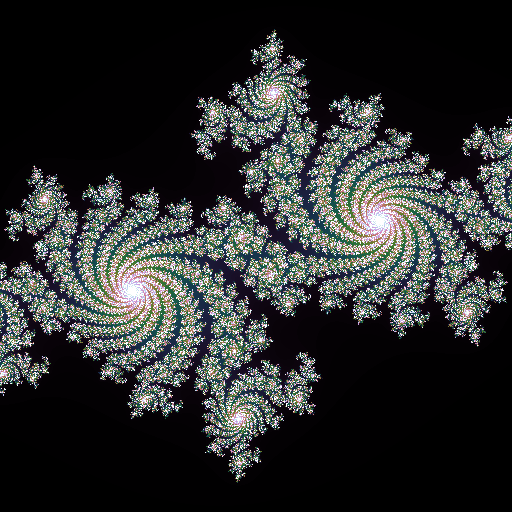
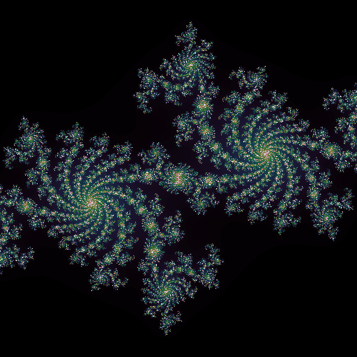
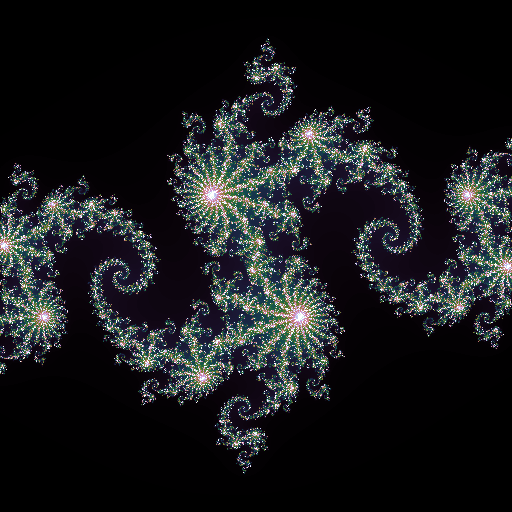
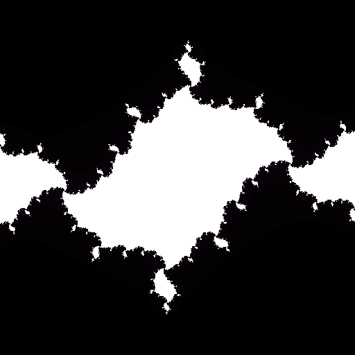
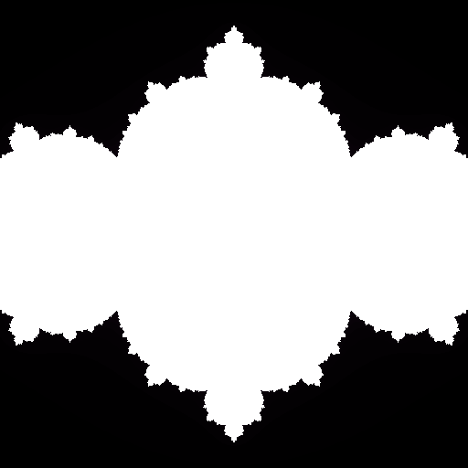

..
  README.rst created with generate_readme.py, don't edit this file manually.

Fractals in Python
==================

Repository with Python code that renders fractals, compatible with both Python
2.7 and 3.2+.

For more information about the maths used for fractals (as well as its
history), see the Wikipedia pages about the
`Julia set`_ and `Mandelbrot set`_.

.. _`Julia set`: https://en.wikipedia.org/wiki/Julia_set
.. _`Mandelbrot set`: https://en.wikipedia.org/wiki/Mandelbrot_set

Examples
--------

Julia Fractal for constant ``-0.7+0.27015j`` and depth ``512``, with
512x512 pixels (Colormap: cubehelix)

Julia Fractal for constant ``-0.7102+0.2698j`` and depth ``512``, with
512x512 pixels (Colormap: cubehelix)

Julia Fractal for constant ``-0.8+0.156j`` and depth ``512``, with
512x512 pixels (Colormap: cubehelix)

Julia Fractal for constant ``-1.037+0.17j`` and depth ``512``, with
512x512 pixels (Colormap: cubehelix)

Julia Fractal for constant ``-0.644`` and depth ``512``, with
512x512 pixels (Colormap: cubehelix)

